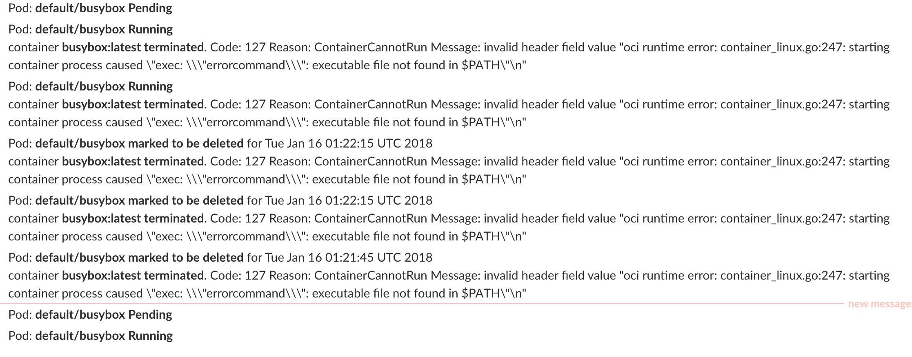

[](https://travis-ci.org/zmalik/k8s-publisher)

# k8s-publisher

A simple kubernetes controller that watches pods for any changes and notify to sinks based on pods annotations

The idea behing k8s-publisher is to empower pod level custom channels, and avoid a super sink to aggregate all events of a kubernetes cluster. And make it easy a pod diagnostic in case of naive errors.


## Slack integration

The very first integration is with slack. You can define a slack channel to subscribe for a pod.

```
annotations:
  # Tell k8s-publisher to send notifications of failure to slack #my-channel
  notify-channels: "[{\"type\":\"slack\", \"value\":\"#my-channel\"}]"
```

And the k8s-publisher takes care of publishing messages related to the pod to that channel.

## Installation

```
git clone https://github.com/zmalik/k8s-publisher.git
```

edit the `deploy/deployment.yaml` file and add your slack-api-token

```
kubectl create -f deploy/deployment.yaml
```

A k8s-publisher pod will run and keep an eye on all pods and keep checking for the `notify-channels` annotation.





## Work in Progress

This is a work in progress to add more integrations like http/stdout or email.